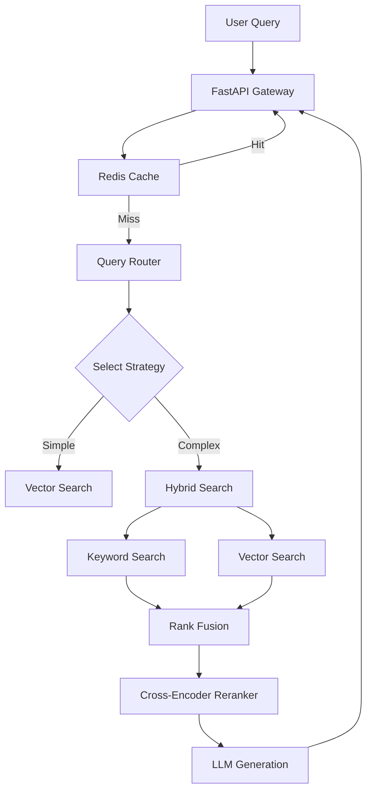

# Production-Grade Adaptive RAG System

A high-performance, production-ready Adaptive RAG system that competes with state-of-the-art solutions like Perplexity and OpenAI's reasoning models.

## 🌟 Key Features

- **Adaptive Routing**: Intelligently routes queries to the best strategy (Simple Fact, Complex Reasoning, Comparison, Summary).
- **Hybrid Search**: Combines **BM25 Keyword Search** and **Qdrant Vector Search** using **Reciprocal Rank Fusion (RRF)** for superior retrieval accuracy.
- **Advanced Reranking**: Uses Cross-Encoders to rerank retrieved documents, ensuring the most relevant context is used.
- **High Performance**:
    - **Async I/O**: Optimized API handling for high concurrency.
    - **Redis Caching**: Caches search results, embeddings, and LLM responses for sub-second latency.
- **Production Infrastructure**: Fully containerized with Docker (FastAPI + Qdrant + Redis).
- **Multi-Provider Support**: Seamlessly switch between OpenAI, Groq, and Ollama.

## 🚀 Quick Start

### 1. Prerequisites
- Docker & Docker Compose
- OpenAI API Key (or Groq/Ollama)

### 2. Setup Environment
```bash
cp .env.example .env
# Edit .env and add your API keys
```

### 3. Start System
```bash
./start_app.sh
```
This will start:
- **RAG API**: http://localhost:8000
- **Qdrant Vector DB**: http://localhost:6333
- **Redis Cache**: http://localhost:6379

### 4. Ingest Data
Place your PDFs in `data/pdfs` and run:
```bash
curl -X POST "http://localhost:8000/api/v1/ingest" \
     -H "Content-Type: application/json" \
     -d '{"data_dir": "data/pdfs"}'
```

### 5. Query
```bash
curl -X POST "http://localhost:8000/api/v1/query" \
     -H "Content-Type: application/json" \
     -d '{"question": "What are the key changes in the 2026 F1 regulations?"}'
```

## 🏗 Architecture



## 🛠 Configuration

### Strategies (`config/strategies.yaml`)
Customize behavior for different query types:
- **Simple Fact**: Fast retrieval, no reranking.
- **Reasoning**: Deep retrieval, chain-of-thought prompting.
- **Comparison**: Multi-entity retrieval.

### Providers (`config/providers.yaml`)
Configure LLM and Embedding providers:
- **LLM**: OpenAI GPT-4, Groq Llama 3, Ollama
- **Embeddings**: OpenAI, Local (HuggingFace)

## 📦 Tech Stack

- **Backend**: Python 3.12, FastAPI
- **Vector DB**: Qdrant
- **Cache**: Redis
- **Search**: BM25 + Qdrant + Cross-Encoders
- **LLM Orchestration**: Custom Adaptive Pipeline

## 🧪 Testing

Run the test suite:
```bash
python test_adaptive.py
```
